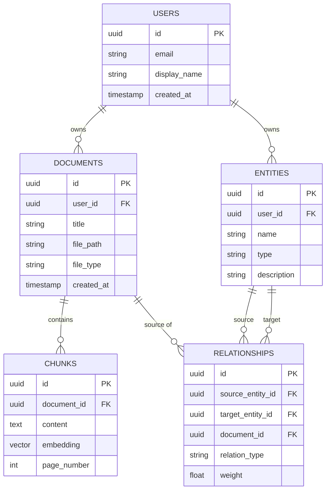

# Database Schema

Database: **PostgreSQL** with **pgvector** extension.
ORM/Query Builder: **Prisma** or **Drizzle**.

## 1. Schema Diagram

## 2. Table Definitions

### Table: `users`
Tracks authenticated users. Synced from Firebase Auth.
*   `id` (UUID, Primary Key) - Matches Firebase UID.
*   `email` (VARCHAR, Unique)
*   `created_at` (TIMESTAMP, Default: NOW)

### Table: `documents`
Metadata for uploaded files.
*   `id` (UUID, Primary Key)
*   `user_id` (UUID, Foreign Key -> users.id)
*   `title` (VARCHAR) - Extracted from filename or AI.
*   `file_url` (VARCHAR) - Firebase Storage URL.
*   `created_at` (TIMESTAMP)

### Table: `chunks`
Holds the actual text data and vector embeddings for semantic search (RAG).
*   `id` (UUID, Primary Key)
*   `document_id` (UUID, Foreign Key -> documents.id)
*   `content` (TEXT) - The raw chunked text.
*   `embedding` (VECTOR) - `pgvector` column (dimensions depend on Gemini embedding model, e.g., 768).
*   `page_number` (INT, Nullable) - For citations.

### Table: `entities` (Graph Nodes)
The concepts extracted by AI.
*   `id` (UUID, Primary Key)
*   `user_id` (UUID, Foreign Key -> users.id) - Ensures row-level security.
*   `name` (VARCHAR) - e.g., "Alan Turing", "Neural Networks".
*   `type` (VARCHAR) - e.g., "Person", "Technology", "Concept".

### Table: `relationships` (Graph Edges)
The edges connecting entities.
*   `id` (UUID, Primary Key)
*   `source_entity_id` (UUID, Foreign Key -> entities.id)
*   `target_entity_id` (UUID, Foreign Key -> entities.id)
*   `document_id` (UUID, Foreign Key -> documents.id) - The document where this relationship was discovered.
*   `relation_type` (VARCHAR) - e.g., "invented", "is related to".

## 3. Required Indexes
*   **Vector Index:** Create an HNSW (Hierarchical Navigable Small World) index on `chunks.embedding` for fast similarity search.
    *   `CREATE INDEX ON chunks USING hnsw (embedding vector_cosine_ops);`
*   **Foreign Keys:** Indexes on all foreign key columns (`user_id`, `document_id`, `source_entity_id`, `target_entity_id`) to speed up JOINs and Graph traversal.
