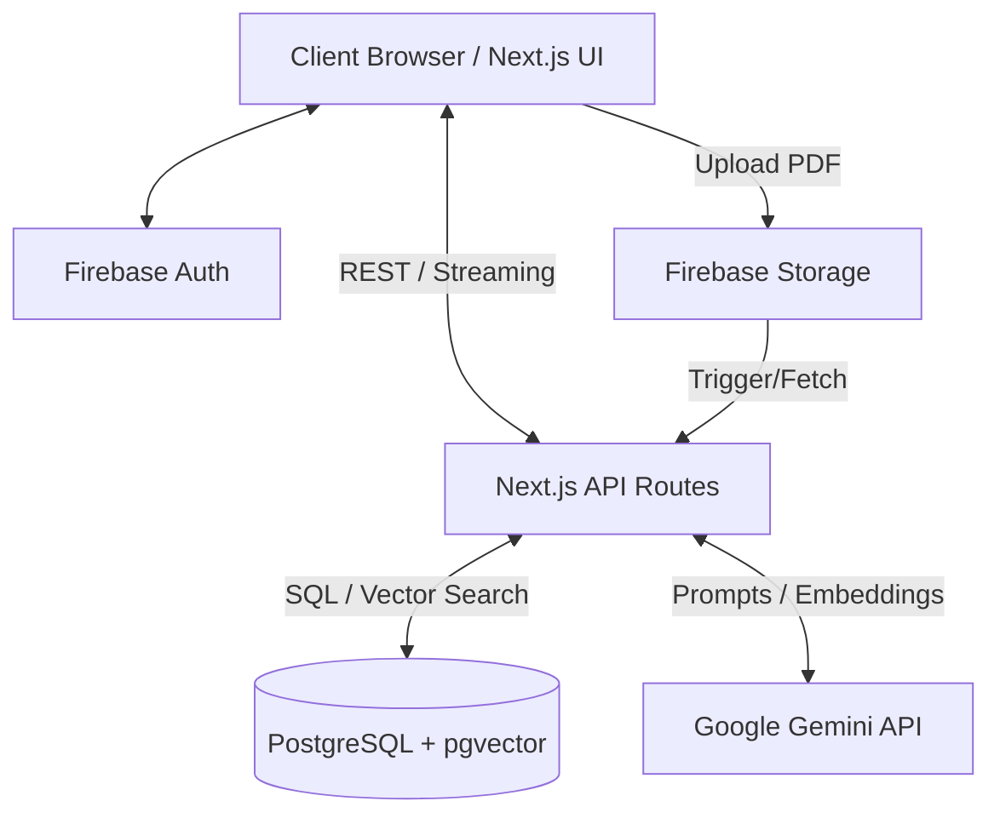

# System Architecture

## 1. High-Level Architecture Overview
NEURONEX utilizes a modern, serverless-first architecture optimized for rapid development and scalability. It leverages Next.js for both the frontend and API layers, Firebase for identity and blob storage, and PostgreSQL for relational and vector data.

## 2. Component Details

### 2.1 Frontend (Next.js App Router)
*   **Framework:** React 18, Next.js 14+ (App Router).
*   **State Management:** React Context (for Auth/Global state), Zustand (for Graph/UI state).
*   **Styling:** Tailwind CSS + Shadcn UI (Radix primitives).
*   **Visualization:** React Flow (2D Graph), React Three Fiber (3D Graph).

### 2.2 Backend (Next.js API Routes)
*   **Environment:** Node.js serverless functions (Vercel).
*   **AI Orchestration:** LangChain JS. Handles document splitting, LLM chains, and RAG pipelines.
*   **Database Client:** Prisma ORM or Drizzle ORM for type-safe database queries.

### 2.3 Data Layer (PostgreSQL)
*   **Hosting:** Supabase or Neon (serverless Postgres).
*   **Vector Engine:** `pgvector` extension enabled for storing 768-dimensional (or Gemini equivalent) vector embeddings.

### 2.4 External Services
*   **Firebase:** Authentication (JWT validation via Firebase Admin SDK in API routes) and Cloud Storage.
*   **Google Gemini API:** Used for text summarization, entity extraction (via structured JSON output), and generating embeddings.

## 3. Deployment Architecture
*   **Hosting:** Vercel (Frontend & Serverless API).
*   **Database Hosting:** Supabase/Neon.
*   **CI/CD:** GitHub Actions or Vercel built-in CI.
*   **Environment Variables:** Managed via Vercel dashboard (`DATABASE_URL`, `GEMINI_API_KEY`, `FIREBASE_ADMIN_CREDENTIALS`).

## 4. Scalability & Bottlenecks
*   **Bottleneck:** Vercel 10s/60s Serverless Timeout.
    *   **Mitigation:** For large PDF processing, the client will split the document into batches and call the ingestion API sequentially, OR we implement a lightweight background queue (e.g., Upstash/QStash) to handle async processing.
*   **Bottleneck:** Rendering large graphs in the browser.
    *   **Mitigation:** Implement culling (only rendering nodes in viewport) and bounding box optimizations in React Flow. For 3D, use instanced meshes in React Three Fiber.
